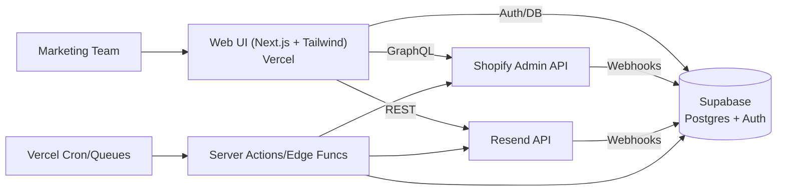

# Edge Food Equipment — Marketing Kanban & Email Platform

A centralized platform to design, segment, and broadcast marketing emails for Edge Food Equipment with a single kanban board to manage campaigns across funnel phases (awareness, acquisition, conversion, care). Built to run on Shopify + Supabase + Vercel with Resend for email delivery.

Yes — this can be built with Shopify, Supabase (managed via MCP), and Vercel.


### Goals
- **Centralized email creation**: shared CSS design system, design tokens, Inter font, black theme.
- **Single source of truth**: campaigns, templates, segments, products, and metrics.
- **Shopify integration**: GraphQL/Admin API for products, customers, orders, tags.
- **Resend integration**: broadcast emails, capture delivery/open/click events.
- **Kanban orchestration**: campaign phases and marketing funnel phases in one board.


### Architecture



### Tech Stack
- **Frontend**: Next.js (App Router), TypeScript, Tailwind CSS (black theme, Inter font)
- **Backend**: Next.js server actions/route handlers on Vercel
- **Data**: Supabase Postgres (+ RLS), Supabase Auth
- **Integrations**: Shopify Admin GraphQL API, Resend API
- **Background**: Vercel Cron + Queues (for syncs, scheduled sends)
- **Infra**: Vercel (hosting), Supabase (DB), GitHub


### Kanban Model
- **Columns (project phases)**: Backlog → Plan → Build → QA → Approve → Scheduled → Sent → Analyze
- **Swimlanes (funnel phases)**: Awareness | Acquisition | Conversion | Care
- Each card references a `campaign` and includes status, funnel phase, due dates, owner, and links to email drafts and segments.


### Data Model (Supabase)
Minimal core tables; extend as needed. Types shown in SQL for clarity.

```sql
-- Enum for funnel phases
create type funnel_phase as enum ('awareness', 'acquisition', 'conversion', 'care');

-- Campaigns
create table if not exists campaigns (
  id uuid primary key default gen_random_uuid(),
  name text not null,
  description text,
  funnel funnel_phase not null,
  kanban_status text not null default 'Backlog',
  scheduled_at timestamptz,
  created_by uuid references auth.users(id),
  created_at timestamptz not null default now(),
  updated_at timestamptz not null default now()
);

-- Email templates (React Email + design tokens)
create table if not exists email_templates (
  id uuid primary key default gen_random_uuid(),
  name text not null,
  version int not null default 1,
  jsx_source text not null,         -- TSX/JSX source (stored string)
  compiled_html text,               -- optional precompiled HTML
  tokens jsonb not null default '{}',
  created_at timestamptz not null default now()
);

-- Campaign emails
create table if not exists campaign_emails (
  id uuid primary key default gen_random_uuid(),
  campaign_id uuid not null references campaigns(id) on delete cascade,
  template_id uuid not null references email_templates(id),
  subject text not null,
  from_email text not null,
  preview_text text,
  status text not null default 'draft',
  created_at timestamptz not null default now()
);

-- Segments & rules (JSON logic or internal format)
create table if not exists segments (
  id uuid primary key default gen_random_uuid(),
  name text not null,
  description text,
  definition jsonb not null,        -- e.g., JSON rules; compiled to SQL
  created_at timestamptz not null default now()
);

-- Customers (synced from Shopify)
create table if not exists shopify_customers (
  id bigint primary key,            -- Shopify numeric ID
  email text, first_name text, last_name text,
  tags text[],
  accepts_marketing boolean not null default false,
  created_at timestamptz,
  updated_at timestamptz
);

-- Products (synced from Shopify)
create table if not exists shopify_products (
  id bigint primary key,
  title text not null,
  handle text not null,
  vendor text,
  product_type text,
  tags text[],
  created_at timestamptz,
  updated_at timestamptz
);

-- Orders (synced from Shopify)
create table if not exists shopify_orders (
  id bigint primary key,
  customer_id bigint references shopify_customers(id) on delete cascade,
  total_price numeric,
  currency text,
  created_at timestamptz,
  updated_at timestamptz
);

-- Membership of segment -> customers (materialized by jobs)
create table if not exists segment_members (
  segment_id uuid references segments(id) on delete cascade,
  customer_id bigint references shopify_customers(id) on delete cascade,
  primary key (segment_id, customer_id)
);

-- Email sends
create table if not exists email_sends (
  id uuid primary key default gen_random_uuid(),
  campaign_email_id uuid not null references campaign_emails(id) on delete cascade,
  segment_id uuid references segments(id),
  send_request_id text,             -- Resend id
  status text not null default 'queued',
  scheduled_for timestamptz,
  created_at timestamptz not null default now()
);

-- Email events (Resend webhooks)
create table if not exists email_events (
  id bigserial primary key,
  send_request_id text,
  event_type text not null,         -- delivered|opened|clicked|bounced|complained|unsubscribed
  recipient text not null,
  ts timestamptz not null default now(),
  metadata jsonb
);
```

RLS is recommended for all user-facing tables to enforce least-privilege access.


### Design System
- **Tokens**: store canonical tokens (JSON) and emit CSS variables for UI and email templates.
- **Font**: Inter with `font-display: swap`.
- **Theme**: black background, high-contrast text, neon accents. Ensure email accessibility (contrast AA+).
- **Central CSS**: produce an inlined subset for emails (React Email inlines styles) and global CSS for the app.

Example tokens
```json
{
  "color": {
    "bg": { "black": "#0a0a0a" },
    "fg": { "base": "#e6e6e6", "muted": "#a3a3a3" },
    "accent": { "neon": "#20f3ff" },
    "success": { "neon": "#00ff88" },
    "warning": { "neon": "#ffb020" },
    "danger": { "neon": "#ff3b5c" }
  },
  "space": { "xs": 4, "sm": 8, "md": 16, "lg": 24, "xl": 32 },
  "radius": { "sm": 6, "md": 10, "lg": 16 }
}
```

CSS variables (app theme)
```css
:root {
  --bg-black: #0a0a0a;
  --fg-base: #e6e6e6;
  --fg-muted: #a3a3a3;
  --accent-neon: #20f3ff;
  --success-neon: #00ff88;
  --warning-neon: #ffb020;
  --danger-neon: #ff3b5c;
  --radius-sm: 6px;
  --radius-md: 10px;
  --radius-lg: 16px;
}
body { background: var(--bg-black); color: var(--fg-base); }
```


### Email Templating (React Email + Resend)
- Author emails in `emails/` using React Email components with Inter font and tokens.
- Compile and send via Resend.

React Email example
```tsx
// emails/Announcement.tsx
import {
  Html, Head, Preview, Heading, Text, Link, Section
} from '@react-email/components';

export default function Announcement() {
  return (
    <Html>
      <Head>
        <title>Edge — New Product</title>
        <style>{`:root{--accent:#20f3ff} body{background:#0a0a0a;color:#e6e6e6;font-family:Inter,Arial}`}</style>
      </Head>
      <Preview>Announcing our latest product</Preview>
      <Section>
        <Heading style={{ color: 'var(--accent)' }}>Introducing...</Heading>
        <Text>Details about the product go here.</Text>
        <Link href="https://edgefoodequipment.com" style={{ color: 'var(--accent)' }}>Shop now</Link>
      </Section>
    </Html>
  );
}
```

Send with Resend (server)
```ts
import { Resend } from 'resend';
import Announcement from '@/emails/Announcement';

const resend = new Resend(process.env.RESEND_API_KEY!);

export async function sendCampaign(to: string[]) {
  return resend.emails.send({
    from: 'Edge <marketing@edgefoodequipment.com>',
    to,
    subject: 'New Product',
    react: Announcement({})
  });
}
```


### Shopify Integration
- Create a Shopify app with scopes: `read_products`, `read_customers`, `read_orders`, `read_product_listings` (adjust as needed). For sending email, you will use Resend, not Shopify Email.
- Use Admin GraphQL API for data sync, webhooks for updates.

Sample product query
```graphql
query Products($first: Int!) {
  products(first: $first) {
    edges { node { id title handle vendor productType tags updatedAt } }
  }
}
```

Recommended webhooks
- `customers/create`, `customers/update`, `orders/create`, `orders/updated`, `products/create`, `products/update`.


### Segments
- Define segments via JSON rules (e.g., by tags, order counts, product types, last purchase date).
- A job compiles JSON rules to SQL and refreshes `segment_members`.

Example definition
```json
{
  "all": [
    { 
      "+daysSinceLastOrder": { "lt": 90 } 
    },
    { "hasTag": "wholesale" }
  ]
}
```

Example SQL materialization sketch
```sql
insert into segment_members (segment_id, customer_id)
select $1 as segment_id, c.id
from shopify_customers c
where c.accepts_marketing
  and (c.tags @> array['wholesale']::text[])
  and exists (
    select 1 from shopify_orders o
    where o.customer_id = c.id and o.created_at > now() - interval '90 days'
  )
on conflict do nothing;
```


### Environment Variables
- `SHOPIFY_STORE_DOMAIN`
- `SHOPIFY_ADMIN_ACCESS_TOKEN`
- `SHOPIFY_API_VERSION` (e.g., 2024-07)
- `RESEND_API_KEY`
- `SUPABASE_URL`, `SUPABASE_ANON_KEY`, `SUPABASE_SERVICE_ROLE_KEY`
- `NEXT_PUBLIC_SUPABASE_URL`, `NEXT_PUBLIC_SUPABASE_ANON_KEY`
- `RESEND_WEBHOOK_SECRET`
- `SHOPIFY_WEBHOOK_SECRET`


### Setup (Local)
1. Create Supabase project; apply SQL above (or via migrations). Enable RLS and policies.
2. Create a Shopify app, set Admin API scopes, install on store, get Admin token.
3. Create Resend project and API key; configure domain and DKIM.
4. Next.js app:
   - Install deps: `next`, `react`, `@supabase/supabase-js`, `@shopify/shopify-api`, `resend`, `@react-email/components`, `zod`.
   - Tailwind: configure PostCSS with `@tailwindcss/postcss` plugin, not `tailwindcss` directly in PostCSS.
   - Add Inter via `next/font/google`.
5. Add `.env.local` with the variables above.
6. Implement route handlers: `/api/webhooks/shopify`, `/api/webhooks/resend`, `/api/sync/shopify`.
7. Run dev: `pnpm dev` (or `npm run dev`).


### Deployment
- **Vercel**: import repo, set env vars, enable Cron for: nightly Shopify sync, segment refresh, scheduled sends.
- **Supabase**: host Postgres + Auth; manage migrations via CLI or MCP.
- **Domains/DNS**: configure Resend sender domain and DKIM, custom tracking domain if needed.


### Security & Compliance
- Enforce RLS for user access; store minimal PII; encrypt sensitive fields if required.
- Verify all webhooks (HMAC). Rate-limit API routes.
- Include unsubscribe links in all emails; honor suppression lists.
- Log delivery/open/click/bounce/complaint events; suppress future sends accordingly.


### Kanban Usage
- Each `campaign` is a card. Columns reflect project status; swimlane is funnel phase.
- Cards link to: design doc, email draft, target segment(s), scheduled send, and post-send metrics dashboard.


### Roadmap (Initial)
- Schema & migrations
- Shopify sync (products, customers, orders) + webhooks
- Segment builder (JSON → SQL) + materializer
- Email composer (React Email) + tokens + live preview
- Resend integration + webhooks + suppression handling
- Kanban board UI (drag/drop, swimlanes)
- Dashboards (deliverability, CTR, revenue attribution)


### License
Private (Edge Food Equipment internal).
